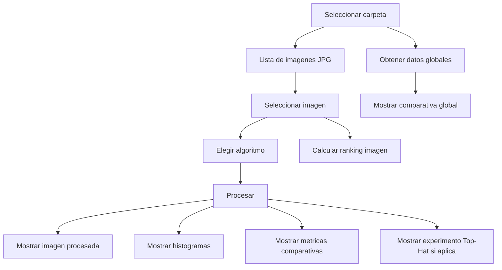
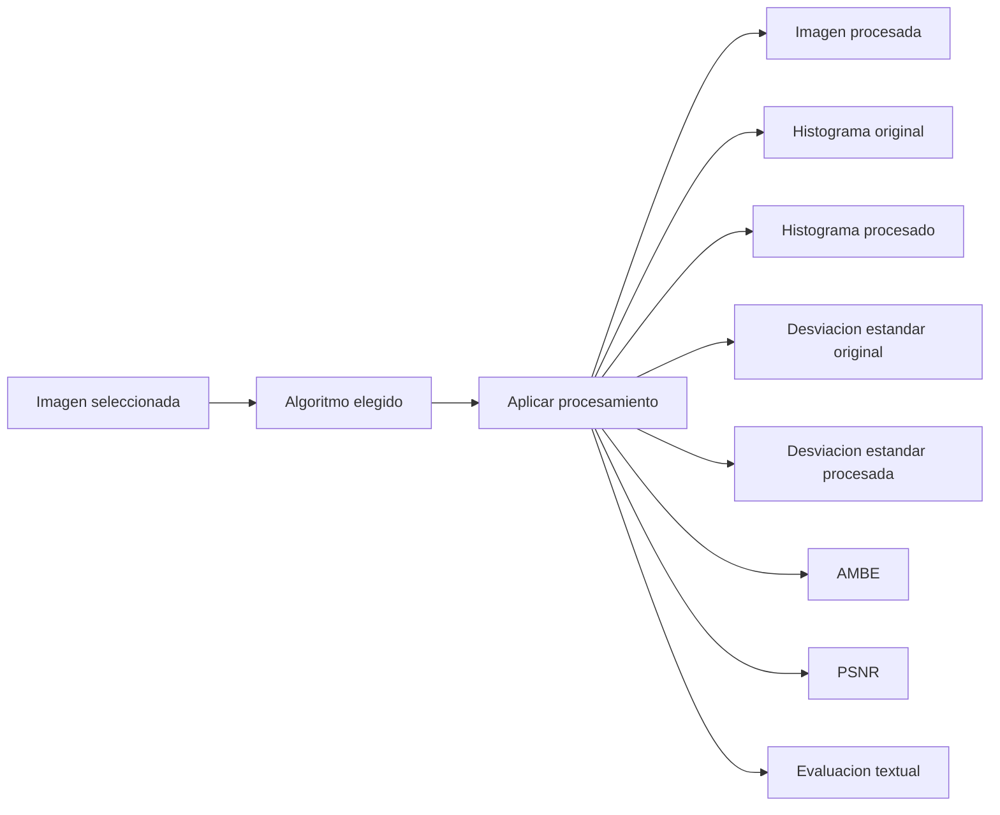
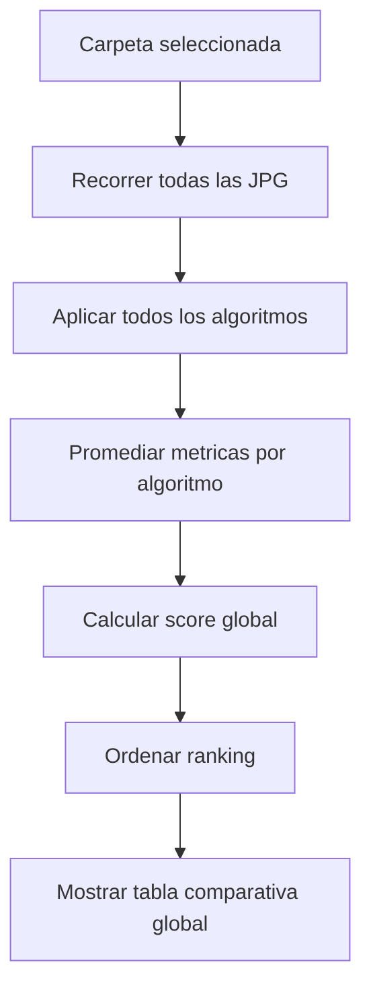
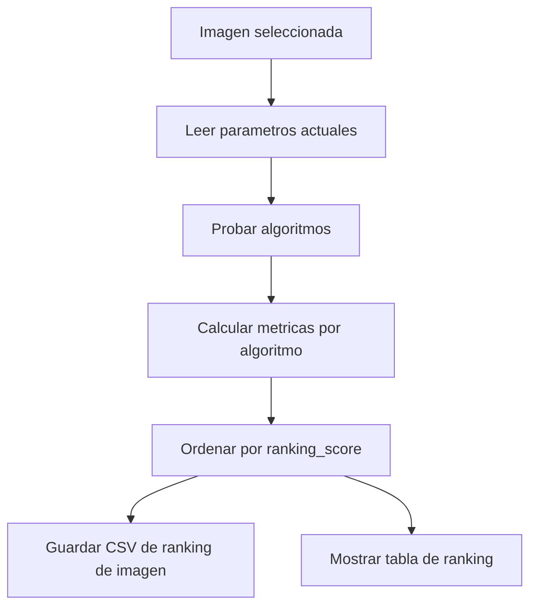

# Documentacion del Proyecto

## Proposito

Esta aplicacion de escritorio permite explorar imagenes medicas JPG y comparar tecnicas de mejora de contraste sobre una imagen individual o sobre una carpeta completa.

La interfaz incluye:
- visualizacion de imagen original
- visualizacion de imagen procesada
- histogramas original y procesado
- metricas de comparacion
- ranking por imagen
- comparativa global por carpeta
- experimento Top-Hat con varios kernels

## Estructura general



## Algoritmos disponibles

### 1. HE

`Histogram Equalization`

Redistribuye la intensidad de la imagen para mejorar el contraste global.

### 2. CLAHE

`Contrast Limited Adaptive Histogram Equalization`

Mejora el contraste por regiones y limita la amplificacion local con `clipLimit`.

### 3. White Top-Hat

Resalta detalles claros pequenos sobre un fondo mas oscuro.

### 4. Black Top-Hat

Resalta detalles oscuros pequenos sobre un fondo mas claro.

### 5. Enhanced Top-Hat

Combina ambos operadores:

```text
IE = I + WTH - BTH
```

Donde:
- `I` = imagen original
- `WTH` = White Top-Hat
- `BTH` = Black Top-Hat

## Flujo de uso de la aplicacion

### Paso 1: abrir carpeta

Presiona `Abrir carpeta` y selecciona una carpeta con imagenes JPG.

La aplicacion:
- detecta las imagenes compatibles
- llena el panel izquierdo con la lista
- no selecciona ninguna imagen por defecto

### Paso 2: seleccionar una imagen

Haz click sobre una imagen del panel izquierdo.

En ese momento se muestran:
- la imagen original
- el histograma original

Todavia no se procesa ninguna mejora hasta presionar `Procesar`.

### Paso 3: elegir algoritmo

Selecciona uno de los algoritmos en el combo.

Comportamiento de los parametros:
- `HE`: no necesita parametros extra
- `CLAHE`: usa `clipLimit` y `tileGridSize`
- `Top-Hat`: usa `kernel`

### Paso 4: procesar

Presiona `Procesar`.

La interfaz mostrara:
- imagen original
- imagen procesada
- histograma original
- histograma procesado
- metricas comparativas
- evaluacion textual automatica

## Diagrama del flujo de procesamiento



## Resultado esperado por algoritmo

### HE

Se espera:
- aumento de contraste global
- cambio visible en la distribucion del histograma
- posible alteracion del brillo medio

### CLAHE

Se espera:
- mejora mas localizada del contraste
- menor saturacion que HE
- mejor control visual en zonas con variacion desigual

### White Top-Hat

Se espera:
- realce de estructuras claras pequenas
- aumento del contraste local en detalles brillantes

### Black Top-Hat

Se espera:
- realce de estructuras oscuras pequenas
- mejor separacion de detalles oscuros respecto al fondo

### Enhanced Top-Hat

Se espera:
- equilibrio entre estructuras claras y oscuras
- gran sensibilidad a detalles finos
- normalmente muy util para exploracion visual

## Metricas comparativas

La aplicacion calcula:
- `Std. dev. original`
- `Std. dev. procesada`
- `AMBE`
- `PSNR`

### Significado de cada metrica

- `Std. dev.`: desviacion estandar de intensidades. Sirve como aproximacion del contraste global.
- `AMBE`: `Absolute Mean Brightness Error`. Indica cuanto cambia el brillo medio.
- `PSNR`: `Peak Signal-to-Noise Ratio`. Mide similitud respecto a la imagen original.

### Interpretacion rapida

- mayor `Std. dev. procesada` suele significar mas contraste
- menor `AMBE` significa mejor preservacion del brillo
- mayor `PSNR` implica menor distorsion global

## Evaluacion textual automatica

Despues de procesar una imagen, la interfaz genera una evaluacion corta basada en:
- cambio de contraste
- preservacion del brillo

La lectura puede indicar, por ejemplo:
- aumento o disminucion de contraste
- brillo preservado razonablemente o con cambio notable

## Comparativa global

La comparativa global evalua cada algoritmo sobre todas las imagenes JPG de la carpeta seleccionada.

### Que calcula

Para cada algoritmo:
- promedio de desviacion estandar original
- promedio de desviacion estandar procesada
- promedio de AMBE
- promedio de PSNR
- cambio global de contraste
- score de ranking

### Cuando se muestra

Solo aparece cuando se presiona:
- `Obtener datos globales`

### Diagrama de la comparativa global



## Ranking de una sola imagen

El ranking por imagen compara todos los algoritmos aplicados a la imagen seleccionada.

### Que calcula

Para la imagen actual se obtienen:
- `original_std`
- `processed_std`
- `std_delta`
- `AMBE`
- `PSNR`
- `contrast_effect`
- `ranking_score`

### Cuando se muestra

Solo aparece cuando se presiona:
- `Calcular ranking imagen`

### Diagrama del ranking de imagen



### Explicacion simple de los apartados

Para que el ranking sea facil de entender, cada imagen se evalua con cuatro ideas simples:

- **Mejor contraste**: la version donde los detalles se ven mas marcados y la imagen se ve mas “viva” o con mas separacion entre zonas claras y oscuras.
- **Mejor brillo**: la version que mantiene el brillo mas parecido al original, sin oscurecer demasiado ni iluminar de mas.
- **Menor distorsion**: la version que cambia menos respecto a la imagen original, es decir, la que conserva mejor su apariencia general.
- **Mejor general**: la version que logra el mejor balance entre contraste, brillo y distorsion.

### Formula de mejor general

El programa usa un puntaje compuesto llamado `ranking_score`:

```text
ranking_score = (processed_std * 0.5) + (PSNR * 0.05) - (AMBE * 0.5)
```

Interpretacion sencilla:
- si sube el contraste, el puntaje mejora
- si el brillo cambia poco, el puntaje mejora
- si la imagen se parece mas al original, el puntaje mejora

En resumen, `mejor general` es el algoritmo que mejor equilibra esos tres aspectos al mismo tiempo.

## Parametros por defecto de la aplicacion

La aplicacion usa estos valores por defecto:

- `CLAHE clipLimit = 2.0`
- `CLAHE tileGrid = 8 x 8`
- `Top-Hat kernel = 15`

Estos valores se usan en el procesamiento interactivo y tambien en el ranking de la imagen cuando corresponda.

## Archivos generados

Todos los resultados se guardan dentro de la carpeta `results/` en la raiz del proyecto.

### Rutas principales

- `results/<nombre_carpeta>_batch/comparativa global.csv`
- `results/<nombre_carpeta>_ranking_imagen.csv`
- `results/<nombre_imagen>_top_hat_kernels.csv`

### Ubicacion relativa al proyecto

Si el proyecto esta en:

```text
/Users/enriqueemmanuelrioschyrnia/Documents/UNI/PDI 2026/Parcial 1/Parcial_1_PDI
```

entonces los archivos se guardan bajo:

```text
/Users/enriqueemmanuelrioschyrnia/Documents/UNI/PDI 2026/Parcial 1/Parcial_1_PDI/results/
```

## Como leer los CSV

### Comparativa global

Contiene una fila por algoritmo o variante.

Columnas tipicas:
- `rank`
- `algorithm`
- `avg_processed_std`
- `avg_ambe`
- `avg_psnr`
- `ranking_score`

### Ranking de imagen

Contiene el ranking por algoritmo para una sola imagen.

Columnas tipicas:
- `image_name`
- `rank`
- `algorithm`
- `original_std`
- `processed_std`
- `std_delta`
- `ambe`
- `psnr`
- `contrast_effect`
- `ranking_score`

## Reglas practicas de interpretacion

### Si quieres mas contraste

Observa:
- `Std. dev. procesada` alta
- `std_delta` positiva

### Si quieres preservar brillo

Observa:
- `AMBE` bajo
- evaluacion textual favorable

### Si quieres menos distorsion

Observa:
- `PSNR` alto

### Si quieres un balance general

Observa:
- buen aumento de contraste
- AMBE bajo
- PSNR aceptable

## Resumen de la interfaz

La pantalla principal esta dividida en:
- panel izquierdo: lista de imagenes
- panel central/derecho: visualizacion de imagen, histogramas, metricas y rankings
- barra superior: carpeta, algoritmo y parametros

## Observaciones finales

- La aplicacion no procesa automaticamente al elegir un algoritmo.
- Siempre se requiere pulsar `Procesar`.
- La comparativa global y el ranking por imagen son vistas separadas.
- El ranking por imagen usa los parametros actuales de la interfaz.
- La comparativa global se calcula solo bajo demanda.
